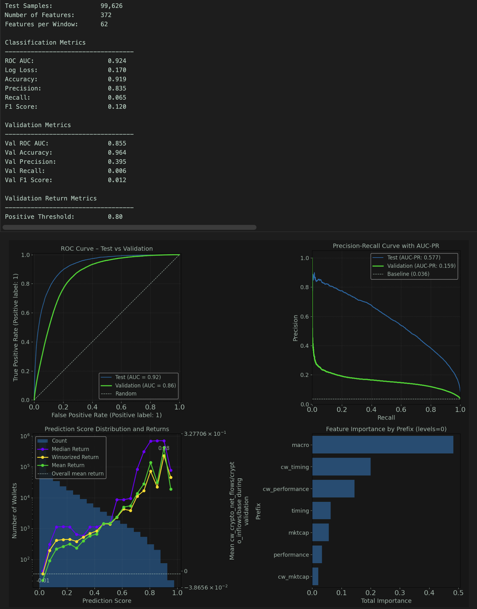
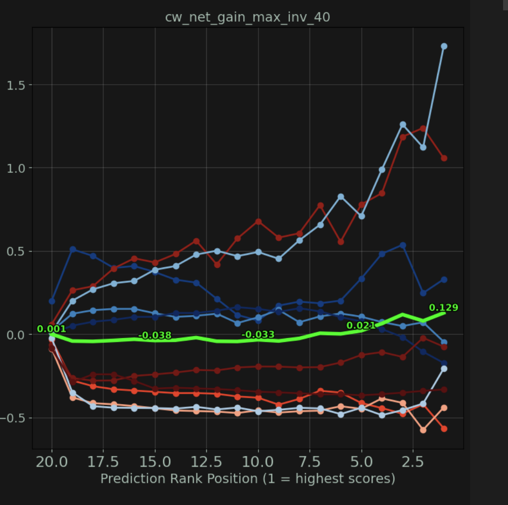
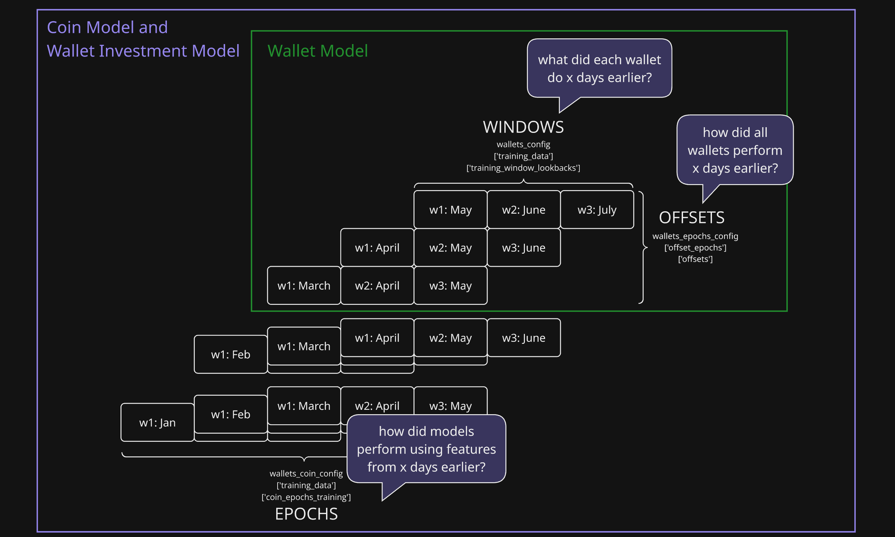

# Project Overview

This project aims to predict cryptocurrency price movements using wallet transaction data. To ensure the model generalizes well to unseen data, we’ve structured the data into distinct time periods and evaluation sets that assess performance across macroeconomic conditions.

## Model Types and Target Variables
We will be constructing models that predict future price performance of three categories over defined time periods:

| Target Type | Primary Key | Description | Example Targets | Location|
|-------------|-----------|-------------|----------|---|
| 1. Wallets | wallet_address |  wallet performance over their full portfolio | absolute USD net gains; return on investment | [src/wallet_modeling](https://github.com/dreams-labs/data-science/tree/main/src/wallet_modeling)|
| 2. Wallet-Coin Pairs | hybridized wallet-coin pair ID |  wallet performance for a single coin only | price movement of the coin; return on investment |[src/wallet_modeling](https://github.com/dreams-labs/data-science/tree/main/src/wallet_modeling)|
| 3. Coins | coin_id | price action for a single coin | price movement of the coin | [src/coin_modeling](https://github.com/dreams-labs/data-science/tree/main/src/coin_modeling)|

Because we know which coins each wallet is holding, we can aggregate wallet model scores into coin-level features. For example, if we score each wallet's probability of having a ROI above 40%, we can then look at the mean/median/distribution/etc of the wallet scores for each coin's holders.

# Key Dataframes

The beauty of this modeling challenge is the simplicity of its input data. We have three primary dataframes, which show:
1. Wallet transfer activity keyed on wallet, coin, and date
2. Coin price behavior keyed on coin and date
3. Macroeconomic conditions keyed on date

With these as a starting point, we can generate thousands of features, such as:
- How well each wallet times their purchases around macroeconomic conditions
- The interaction between whale purchases and price movement of microcap coins
- The overall lifetime profitability of all current investors of a given coin
- Relative buys and sells between whales and small buyers
- Whether coin volume increases or decreases after each wallet's purchase

The data is retrieved from BigQuery via the [src/training_data modules](https://github.com/dreams-labs/data-science/tree/main/src/training_data). The ETLs used to ingest and prepare the source data are maintained within the [ETL Pipelines Repository](https://github.com/dreams-labs/etl-pipelines).

### DataFrame 1: `profits_df`
Shows the transaction history of each wallet-coin pair over a given period of time.

This table is sparsely populated as it includes hundreds of millions of lifetime transfer dates for every holder of all supported coins. It only includes records on days where a coin-wallet pair had transfer transactions. When we need data for intermediary days, we can impute records by ffilling their token balance and comparing it with the current price based on market_data_df.

| Attribute | Value |
|-----------|-------|
| Source | raw Ethereum blockchain data and Dune for other chains
| Unique Key | coin_id-wallet_address-date |
| Size | hundreds of millions of rows |
| Use Case | assess a wallet's lifetime market timing and trading performance|

#### Columns:
| Column Name | Data Type | Details |
|-------------|-----------|-------------|
| coin_id | category | |
| date | datetime64[ns] | |
| wallet_address | int32 | |
| profits_cumulative | float32 | lifetime  |
| usd_balance | float32 | reflects ending balance as of that date |
| usd_net_transfers | float32 | token transfers * current price USD |
| usd_inflows | float32 | that date's USD transfers in |
| usd_inflows_cumulative | float32 | lifetime USD transfers in |
| is_imputed | boolean | whether the record was imputed on the start or end date. if True, usd_net_transfers is always 0 |

### DataFrame 2: `market_data_df`
Shows price, market cap, and volume trajectory of coins, pulled from CoinGecko and GeckoTerminal.

Any missing
| Attribute | Value |
|-----------|-------|
| Source | CoinGecko and GeckoTerminal |
| Unique Key | coin_id-date |
| Size | millions of rows |
| Use Case | assess trends in how market metrics interact with future price action and wallet activity

#### Columns:
| Column Name | Data Type | Description |
|-------------|-----------|-------------|
| coin_id | category | |
| date | datetime64[ns] | |
| price | float32 | imputed rows filled via ffill |
| volume | int32 | imputed rows filled with 0s |
| market_cap | int32 | null if no CoinGecko data is available |
| is_imputed | bool | indicate rows that were added during gaps in price history per CoinGecko |

### DataFrame 3: `macro_trends_df`
Contains macroeconomic indicators such as Google Trends scores, Bitcoin prices and MVRV Z scores, Value Days Destroyed, global volume and market cap, and others.

Creating a generalizable model hinges on proper use of this data, as a model that doesn't work across market conditions cannot be reliably deployed.

| Attribute | Value |
|-----------|-------|
| Source | Google Trends, CoinGecko, BGeoMetrics |
| Unique Key | date |
| Size | thousands of rows |
| Use Case | assess the relationship between macroeconomic indicators and coin or wallet behavior

#### Columns:
| Column Name | Data Type | Description |
|-------------|-----------|-------------|
| date | datetime64[ns] | |
| volume | int32 | imputed rows filled with 0s |
| market_cap | int32 | null if no CoinGecko data is available |
| is_imputed | bool | indicate rows that were added during gaps in price history per CoinGecko |

# Temporal Train/Test/Validation Splits

Data will be segmented into four sets:
* **Training set:** used to train the model
* **Evaluation set:** used to tune model parameters
* **Test set:** used to assess whether model generalizes within the same time period as the Training and Evaluation sets
* **Validation set:** used to assess whether the model generalizes in a **future** time period relative to the Training and Test sets.

### Generating Data Splits

Price movements will be split into three periods that are strictly bounded in time:

1. **Training Period** (e.g. price movements up to 6/30/24)
   - Price movements during this period will be used for feature engineering. This ensures that the model only relies on information that was available at the time of the prediction.

2. **Modeling Period** (e.g. 7/1/24–7/31/24):
   - Price movements during this period will generate the target variables in the Training, Validation, and Test sets.
   - Price movements during this period will also be used to build features for the Future set since it will have access to all transactions up until the start of the Future period.

3. **Future Period** (e.g. 8/1/24-8/31/24):
   - Price movements during this period will generate the target variables in the Future set to assess whether the model can generalize beyond the original time frame, particularly in future market conditions that may be significantly different from the past.

### Evaluation Strategy

- **Validation and Test Sets**: These sets assess whether the model can generalize within the training period. Strong performance here would indicate that the model is able to learn meaningful patterns without overfitting.
- **Future Set**: Performance on this set will determine if the model can generalize to other time periods, particularly when market conditions change.

# Feature Engineering

Features keyed on wallet_ids or hybrid wallet_id-coin_id pairs are generated via the [src/wallet_features/](https://github.com/dreams-labs/data-science/tree/main/src/wallet_features) modules, which include documentation.

Features keyed on coin_ids are generated via the [src/coin_features/](https://github.com/dreams-labs/data-science/tree/main/src/coin_features) modules, which include documentation.

# Modeling

Modeling for wallet_ids or hybrid wallet_id-coin_id pairs are generated via the [src/wallet_modeling/](https://github.com/dreams-labs/data-science/tree/main/src/wallet_modeling) modules, which include documentation.

Features keyed on coin_ids are generated via the [src/coin_modeling/](https://github.com/dreams-labs/data-science/tree/main/src/coin_modeling) modules, which include documentation.

# Model Evaluation

Models are evaluated via the [src/wallet_insights/](https://github.com/dreams-labs/data-science/tree/main/src/wallet_insights) or [src/coin_insights/](https://github.com/dreams-labs/data-science/tree/main/src/coin_insights) modules, which include documentation.

#### Sample Evaluation
This is a high performing classifier model with a true positive being wallets that had over 40% ROI during the modeling period. Note that it generalizes to the validation period, as shown by the green validation set lines mimicing the blue test set lines. We can see in the third chart that wallets with a higher score also show a higher ROI during the period.

# Modeling Across Macroeconomic Conditions

Given the cyclical nature of cryptocurrency, it is critical that our models are able to provide meaningful results across market conditions. To do this, we have developed multiple ways to looking at price behavior across time.

Generalizing across macro conditions was unsurprisingly the hardest aspect of this modeling project. We can see in this example that the model generally performed better with a lower MVRV Z Score (in blue) than it did with a higher MVRV Z Score (in red). Note that the overall average performance (in green) still shows a positive return for higher scores in each period.

## Investing Models

The solution to assessing performance across macroeconomic conditions lies in the "investing" models. These models intake an array of offsets and for each of them, they generate features as of the modeling date, train a model, and assess model performance in the validation (future) period.

For example, an investing model with param [-60, -30, 0] would generate features as of the base modeling date, as of 30 days earlier than the modeling date, and as of 60 days earlier than the modeling date. Investing ROI would be calculated based on the identified buys each month, under the assumption that those buys were held over the 30 day period and then sold. This allows us to assess cumulative model performance as macroeconomic conditions change.

This code exists in the [src/wallet_investing/](https://github.com/dreams-labs/data-science/tree/main/src/wallet_investing) and [src/coin_investing/](https://github.com/dreams-labs/data-science/tree/main/src/coin_investing) modules, which include documentation.

## Temporal Map

- **Windows:** these are flattened as different wallet-level features. In the Temporal
Map example, each wallet would have separate features for each window. These features would show how many USD purchases a wallet made in the most recent month, the month before that, and the month before that, as seen in the first row of the map:
  - Features as of the end of July
    - usd_inflows|w1 (purchases in July)
    - usd_inflows|w2 (purchases in June)
    - usd_inflows|w3 (purchases in May)

- **Offsets:** these represent views of the windows that have been offset by x days. If the base model uses the months in the above examples, we can create "offset" features by shifting the months to reflect behavior during different macro conditions. An offset of -1 month would generate the following features that could be appended as new training data rows to the windows examples above:
  - July Features
    - usd_inflows|w1 (purchases in July)
    - usd_inflows|w2 (purchases in June)
    - usd_inflows|w3  (purchases in May)
  - June Features (offset -1 month)
    - usd_inflows|w1 (purchases in June)
    - usd_inflows|w2 (purchases in May)
    - usd_inflows|w3 (purchases in April)

- **Epochs:** these represent different shifts in the offsets, and are used for metaanalysis of model performance. If a wallet model that was fed the two rows of training data from the above examples, we can assess whether it was able to use June and July features to predict what happened in August. By shifting all of the windows by another month, we can build a comparable model with features as of the next epoch and assess whether the modeling pipeline could predict an upcoming epoch. This allows us to assess model performance across different macroeconomic conditions.
  - August Price Predictor
    - July Features
    - June Features
  - September Price Predictor
    - August Features
    - July Features
  - October Price Predictor
    - September Features
    - August Features

